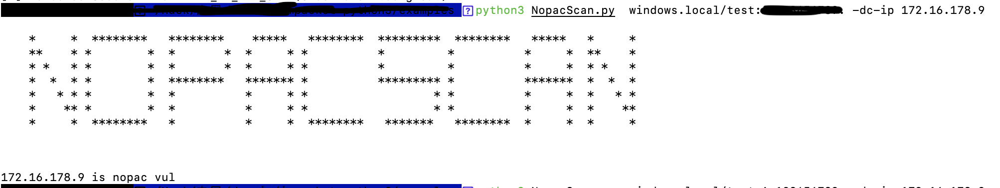

# NoPacScan

NoPacScan is a CVE-2021-42287/CVE-2021-42278 Scanner,it  scan for more domain controllers than the original script, and more accurate than it.It scan DC with DNS search `_msdcs.aaa.com`,it's better than LDAP and SAMR, and it will automatically scan all DC we find.If you use LDAP or SAMR ,maybe you will miss some DC that remove from Primary DC. For more accurate,It scan the Pac where type equal to 0x10 that is the Microsoft main patch for this vulnerable.

Nopac漏洞扫描器，相比其他扫描器能更加精确的扫描更多的DC，通过dns查询`_msdcs.aaa.com`来获取所有的域控制器（相比其他脚本的LDAP获取SAMR协议，通过dns查询能找到那些已经脱域但未在dns中注销的DC）。然后自动扫描所有获取到的DC。漏洞扫描的方式主要是通过获取到解密的PAC文件并查找其中是否有类型为0x10的结构体。（微软打补丁的主要位置）

# Install

Python3.5+impacket

* pip install aiodns

# Usage

```
usage: NopacScan.py [-h] [-debug] [-hashes LMHASH:NTHASH] [-dc-ip ip address] [-dns-ip dns ip address] [-dns-port dns port] credentials

positional arguments:
  credentials           domain/username[:password]

optional arguments:
  -h, --help            show this help message and exit
  -debug                Turn DEBUG output ON

authentication:
  -hashes LMHASH:NTHASH
                        NTLM hashes, format is LMHASH:NTHASH
  -dc-ip ip address     IP Address of the domain controller.
  -dns-ip dns ip address
                        Dns search Ip(default is DC-IP)
  -dns-port dns port    Dns search port (default is 53) scan with 
```

## scan

`python3 NopacScan.py windows.local/test:aaaa -dc-ip 172.16.178.9`

scan with a dc-ip(with this dc ip ,it will find more DC with dns search and automatically scan other DC), if you have a dns ip,you can add it with -dns-ip.

通过dc-ip传入域控地址后，将默认通过DC的dns服务器来进行dns查询，并自动扫描所有查询到的DC。



